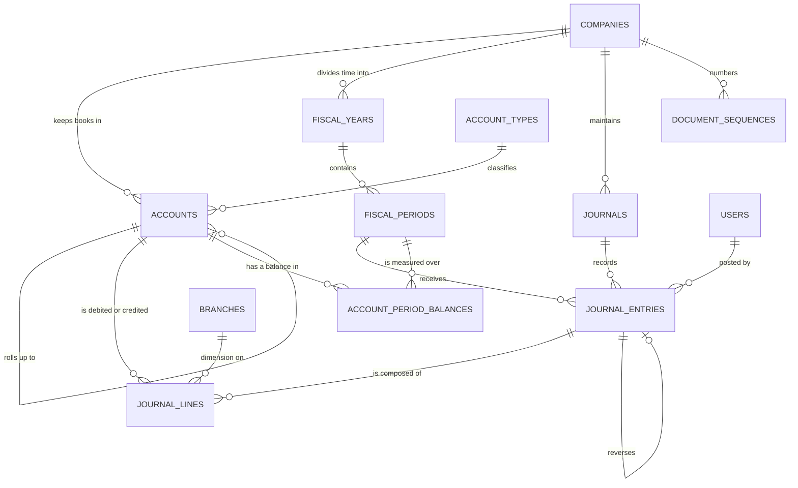

# Phase 2 — Accounting core: analysis and design

**Status: approved 2026-08-07. The three open questions are ruled on in §8; implementation follows the plan in §5.**

Scope agreed: the double-entry foundation every later module posts through. Chart of accounts,
journal entries and lines, the general ledger, fiscal periods and close, opening balances, and the
two reports that prove the ledger is sound — trial balance and account ledger.

Deliberately **out of scope**: customer invoices, supplier bills, payments, tax computation,
inventory, payroll, and foreign-currency transactions. Each posts *into* what this phase builds, and
each is a phase of its own. Building them alongside the ledger would mean exercising the ledger's
invariants with code that is itself unfinished.

---

## 1. Functional analysis

### Who uses this

| Role | What they do here | Phase 1 role that maps to it |
| --- | --- | --- |
| Owner / Financial controller | Defines the chart of accounts, closes periods, closes the year, reopens a period when something must be corrected | `owner`, `administrator` |
| Accountant | Posts and reverses journal entries, reviews the trial balance, investigates an account's history | `accountant` |
| Bookkeeper | Drafts journal entries; cannot post them | `bookkeeper` |
| Auditor / Viewer | Reads the trial balance and account ledger; changes nothing | `viewer` |

The bookkeeper/accountant split is the reason drafting and posting are separate capabilities rather
than one "create journal" permission. It is how a Sri Lankan SME with one qualified accountant and
two data-entry staff actually operates.

### What the system must do

1. **Keep a chart of accounts per company.** Hierarchical, because a controller wants "Bank" to roll
   up three bank accounts on the balance sheet. Each account has a type (asset, liability, equity,
   income, expense) which fixes its normal balance and its statement.
2. **Record every financial event as a balanced double entry.** Debits equal credits, always, with
   no path — service, console command, future module, or direct SQL by someone with database
   access — that can write an unbalanced entry.
3. **Make posted history immutable.** A posted entry is never edited or deleted. A mistake is
   corrected by a reversing entry, which is what an auditor expects to see and what makes the audit
   trail meaningful.
4. **Divide time into fiscal periods and let them be closed.** Once a period is closed, nothing may
   post into it. Reopening is possible, privileged, and audited.
5. **Carry opening balances**, so a business migrating from spreadsheets or another product starts
   with its real position rather than from zero.
6. **Close the year**, moving net income into retained earnings so the next year starts clean.
7. **Report the trial balance and any account's ledger**, both as of a date and for a period range.

### What "done" looks like

A new company can be given a chart of accounts, opening balances, a month of journal entries, and
produce a trial balance that balances — and no sequence of API calls, valid or malicious, can leave
the ledger unbalanced or alter a posted entry.

---

## 2. Technical analysis

Five decisions carry this phase. Each is expensive to revisit once there is customer data.

### 2.1 How money is represented

**Never a float.** Beyond that the real choice is where the decimal point lives.

**Decision: `numeric(19, 4)` in PostgreSQL; a `Money` value object over integer minor units in PHP.**

Scale 4, not 2. Currencies themselves need at most 3 decimal places, but unit prices, tax rates and
allocations need more before rounding — and a system that rounds to 2 at every intermediate step
accumulates error that shows up as a trial balance out by a few cents, which is the single most
expensive kind of bug to chase in an accounting system. Scale 4 with explicit rounding at defined
points is the standard treatment.

PHP has no decimal type. `Money` therefore wraps an `int` of ten-thousandths plus an ISO currency
code, refuses arithmetic between different currencies, and exposes `allocate()` for splitting an
amount across lines so the remainder is distributed rather than lost. `numeric(19,4)` and an int at
scale 4 convert exactly in both directions, so nothing is approximated at the boundary.

`companies.currency_precision` (2 for LKR) governs **display and the rounding applied when an amount
is posted**, not storage.

### 2.2 Debit and credit as two columns

**Decision: `debit` and `credit`, both `numeric(19,4) NOT NULL DEFAULT 0`, both `>= 0`, with a check
that exactly one is non-zero.**

The alternative — one signed `amount` — is less code. Two columns win because the trial balance, the
account ledger and every printed report an accountant recognises are expressed in those terms, so
the storage matches the domain rather than requiring a translation at every read. It also makes the
balance rule a plain SQL statement: `SUM(debit) = SUM(credit)`.

### 2.3 Where the balance rule is enforced

**Decision: a `DEFERRABLE INITIALLY DEFERRED` constraint trigger in PostgreSQL, checked at commit.**

A service-layer check is necessary but not sufficient — Phase 1's stated philosophy is that
invariants live in the database where they can, because a service can be bypassed and a constraint
cannot. It has to be deferred: lines are inserted one at a time, so an immediate check would fail on
the first line of every entry. This mirrors the append-only trigger on `audit_logs`, which is the
existing precedent for constraint triggers in this codebase.

A second trigger makes posted entries append-only, permitting exactly one transition — draft to
posted — and refusing every other UPDATE or DELETE on a posted row.

### 2.4 How balances are read

Two options, and this is the one I most want a decision on.

**(a) Sum the lines on demand.** Simple, always correct, no denormalised state to drift. A trial
balance is `SUM(debit), SUM(credit) GROUP BY account` over the period, which with the right composite
index is fast — until a company has several million lines, at which point every report scans years
of history.

**(b) Maintain `account_period_balances` transactionally.** A row per account per period, updated as
part of the posting transaction. Reports become a scan of a small table. Period close and opening
balances both become natural — a closed period's balance is a stored fact, not a re-derivation. The
cost is denormalised state that can drift, which needs a verification command (the same shape as
`asids:audit-verify`).

**Recommendation: (b), with a `asids:ledger-verify` command that recomputes from the lines and
reports any drift.** An SME on seven-year retention will cross the point where (a) hurts, and
retrofitting aggregates onto a live ledger is harder than maintaining them from the first entry.
The verification command is what keeps the denormalisation honest.

### 2.5 Document numbering

Journal entries need a human-readable number (`JV-2026-04-0001`), unique per company, and for the
statutory documents that arrive in later phases, **gapless** — Sri Lankan e-invoicing will require
it, and a PostgreSQL `SEQUENCE` cannot provide it because a rolled-back transaction consumes a
number.

**Decision: a `document_sequences` table with one row per (company, document type, period),
incremented under `SELECT … FOR UPDATE` inside the posting transaction.**

The cost is honest and worth stating: posting serialises per company per document type. For an SME
posting tens of entries a day this is irrelevant; it would matter for a high-volume tenant, and the
mitigation when that arrives is a separate non-gapless sequence for internal document types with the
gapless one reserved for statutory ones.

### 2.6 Two seams Phase 1 left open, now filled

- **`LedgerActivityProbe`** finally gets a real implementation. This is what makes Phase 1's rule —
  a company's base currency and fiscal calendar become immutable once its books have activity —
  actually bite. Until now `NoLedgerActivity` truthfully reported "no postable table exists".
- **The `Auditable` trait** gets its first production consumer. Journal entries are exactly the
  business documents it was written for; the Phase 1 test fixture stands down to being a
  schema-independent test of the trait itself.

---

## 3. Database design

### New tables

| Table | Purpose | Notes |
| --- | --- | --- |
| `account_types` | The five statement classifications | Seeded from code, not customer-editable |
| `accounts` | Chart of accounts | Hierarchical via `parent_id`; unique `code` per company, case-insensitive |
| `fiscal_years` | A company's financial years | Derived from `companies.fiscal_year_start_*` |
| `fiscal_periods` | Months (or the company's chosen divisions) within a year | `open` / `closed` / `locked` |
| `journals` | Named books — general, sales, purchases, cash | Later modules post into their own journal |
| `journal_entries` | The document header | `draft` / `posted` / `reversed`; append-only once posted |
| `journal_lines` | The debits and credits | Balanced per entry by deferred constraint trigger |
| `account_period_balances` | Per-account per-period aggregates | Maintained transactionally; verifiable |
| `document_sequences` | Gapless per-company counters | Locked row per (company, type, period) |

All nine carry `tenant_id` and `company_id` and get **strict** RLS policies — unlike Phase 1's
nullable-tenant tables, there is no such thing as a platform-owned ledger row.

### Entity relationships



### Constraints that carry the design

Stated as rules rather than DDL, because the point is *which* invariants are the database's job:

- `journal_lines`: `debit >= 0`, `credit >= 0`, and exactly one of them non-zero.
- `journal_lines` per entry: `SUM(debit) = SUM(credit)`, deferred to commit.
- `journal_entries`: once `status = 'posted'`, no UPDATE except the single documented transition to
  `reversed`, and no DELETE — enforced by trigger, as `audit_logs` is.
- `journal_entries`: the entry date must fall inside its `fiscal_period`, and that period must be
  `open` at the moment of posting.
- `accounts`: an account with any posted line may not change `account_type_id`, and may not be
  deleted — only archived. Reclassifying an account silently rewrites every historical statement it
  appears on.
- `accounts`: `parent_id` must belong to the same company and the same account type, and the
  hierarchy may not contain a cycle.
- `fiscal_periods`: no two periods of a company may overlap, and a year's periods must be contiguous.
- `document_sequences`: unique per (company, document type, period).

### An open question on multi-currency

Phase 2 is base-currency only. The question is whether `journal_lines` carries
`currency_code`, `exchange_rate` and `base_amount` **now**, constrained to the company's base
currency at rate 1, or whether they are added in the foreign-currency phase.

**Recommendation: include them now, constrained.** `journal_lines` is the one table you least want to
rewrite: backfilling it on a live tenant with years of history is a maintenance window, and the
constraint means the single-currency rule is enforced rather than merely intended. The cost is three
columns that are uniform until the FX phase, which is honest rather than speculative — they hold real
values, and a check constraint states the current rule.

I want this ruled on explicitly rather than assumed, because the alternative — add them later — is
also defensible if you would rather not carry unused shape.

---

## 4. Folder structure

Follows the Phase 1 convention exactly: `Asids\Core\Accounting`, registered as one line in
`ModuleServiceProvider` after `Organization` and before `Settings`.

```
src/Core/Accounting/
├── Application/
│   ├── DTOs/            CreateAccountData, JournalEntryData, JournalLineData, PeriodRange
│   └── Services/        ChartOfAccountsService, JournalService, PostingService,
│                        FiscalCalendarService, PeriodCloseService, OpeningBalanceService,
│                        LedgerBalanceService, DocumentNumberService
├── Database/
│   ├── Factories/       AccountFactory, JournalEntryFactory, FiscalPeriodFactory
│   ├── Migrations/      2026_02_01_* … 2026_02_09_*
│   └── Seeders/         StandardChartOfAccountsSeeder (Sri Lankan SME template)
├── Domain/
│   ├── Contracts/       LedgerRepositoryContract, ChartOfAccountsRepositoryContract
│   ├── Enums/           AccountType, NormalBalance, JournalEntryStatus, PeriodStatus,
│                        JournalType, DocumentType
│   ├── Events/          JournalEntryPosted, JournalEntryReversed, PeriodClosed,
│                        PeriodReopened, YearClosed, AccountArchived
│   ├── Exceptions/      UnbalancedEntry, PeriodNotOpen, PostedEntryIsImmutable,
│                        AccountInUse, InvalidAccountHierarchy, SequenceExhausted
│   ├── Models/          Account, AccountType, FiscalYear, FiscalPeriod, Journal,
│                        JournalEntry, JournalLine, AccountPeriodBalance, DocumentSequence
│   └── ValueObjects/    Money, AccountCode, DateRange
├── Infrastructure/
│   ├── Ledger/          EloquentLedgerActivityProbe  ← replaces NoLedgerActivity
│   └── Repositories/    EloquentLedgerRepository, EloquentChartOfAccountsRepository
├── Listeners/           MaintainAccountPeriodBalances
├── Policies/            AccountPolicy, JournalEntryPolicy, FiscalPeriodPolicy
├── Presentation/
│   ├── Console/         asids:ledger-verify, asids:ledger-rebuild, asids:open-fiscal-year
│   └── Http/
│       ├── Controllers/ AccountController, JournalEntryController, FiscalPeriodController,
│       │                LedgerReportController
│       ├── Requests/    StoreAccountRequest, UpdateAccountRequest, StoreJournalEntryRequest,
│       │                PostJournalEntryRequest, ReverseJournalEntryRequest, ClosePeriodRequest
│       └── Resources/   AccountResource, JournalEntryResource, JournalLineResource,
│                        TrialBalanceResource, AccountLedgerResource
└── Providers/           AccountingServiceProvider
```

Additions to existing Phase 1 files, all by declaration rather than modification:

- `PermissionCatalogue::accounting()` — a new group, ~14 capabilities.
- `SettingsCatalogue` — an `accounting` group (retained earnings account, whether backdating is
  allowed, journal number format).
- `RoleTemplate` — accounting capabilities added to the accountant, bookkeeper and viewer templates.
- `PlatformServiceProvider` morph map — the new auditable models.
- A migration extending the RLS policy to the nine new tables.

---

## 5. Implementation plan

Six tranches. Each ends with its own tests passing and the full gate suite green, so the phase is
never in a state where the ledger half-exists.

| # | Tranche | Delivers | Tested by |
| --- | --- | --- | --- |
| 1 | **Money and the calendar** | `Money` value object, `AccountCode`, `DateRange`; `fiscal_years` / `fiscal_periods` with their constraints; `FiscalCalendarService` generating a year from the company's fiscal start | Unit tests on `Money` arithmetic, rounding and allocation; period generation across April and January year starts, leap years, and the overlap constraint |
| 2 | **Chart of accounts** | `account_types`, `accounts`, hierarchy rules, `ChartOfAccountsService`, the Sri Lankan SME template seeder, HTTP surface | Hierarchy cycles refused, cross-company parents refused, reclassification blocked once posted, code uniqueness case-insensitive |
| 3 | **The ledger** | `journals`, `journal_entries`, `journal_lines`, both triggers, `JournalService` and `PostingService`, `DocumentNumberService` | The one that matters: unbalanced entries refused at the database *and* the service; posted entries immutable against raw SQL; concurrent posting produces no duplicate or gapped numbers |
| 4 | **Balances and reports** | `account_period_balances` maintained on post, `LedgerBalanceService`, trial balance and account ledger endpoints, `asids:ledger-verify` | Aggregates match a recomputation from lines after posting, reversing and closing; verify command detects deliberately corrupted aggregates |
| 5 | **Opening balances and close** | `OpeningBalanceService`, `PeriodCloseService`, year-end close to retained earnings | Opening balances balance against opening equity; closed periods refuse posting; reopening is audited; year close is idempotent and reversible |
| 6 | **Integration and documentation** | Real `LedgerActivityProbe`, `Auditable` on journal entries, Vue screens for the chart of accounts, journal entry and trial balance, ERD and OpenAPI updates | Phase 1's currency/fiscal immutability rules now fire for real; front-end specs; the full gate suite |

Tranche 3 is the phase. If anything slips, it slips around that.

---

## 6. Risks

| Risk | Likelihood | Impact | Treatment |
| --- | --- | --- | --- |
| **Rounding drift** makes a trial balance out by cents | Medium | High — undermines confidence in the whole product | Scale-4 storage, `Money::allocate()` for every split, rounding only at defined points, and a test that posts a thousand randomised entries and asserts the trial balance is exactly zero |
| **Aggregate drift** between `account_period_balances` and the lines | Medium | High — reports silently wrong | Update inside the posting transaction, never asynchronously; `asids:ledger-verify` in CI and on a schedule, same pattern as the audit chain |
| **Deferred constraint trigger** behaves differently than expected | Medium | High — the central invariant | Prove it in tranche 3 against raw SQL, not only through the service. Phase 1's lesson was that the ordering and environment assumptions are what break |
| **Gapless numbering serialises posting** | Low now, high later | Medium | Documented trade-off; per-company lock scope; revisit when a tenant's volume justifies splitting statutory from internal sequences |
| **Period close is hard to undo** | Medium | High — a wrongly closed year blocks a customer | Close is reversible and audited; year-end close posts an ordinary reversible entry rather than mutating history |
| **The FX columns are used before the FX phase** | Low | Medium — half-built currency handling | The phase-scoped NULL constraint makes it impossible rather than discouraged; dropping it is a deliberate, named act |
| **Scope creep into invoicing** | High | Medium — the ledger's invariants get exercised by unfinished code | The scope boundary above is explicit; AR/AP is a separate phase |
| **Sri Lankan statutory correctness** | High | High | Out of scope here by design. The chart template and any tax treatment must be reviewed by a Sri Lankan chartered accountant before release, as [SECURITY-REVIEW.md](SECURITY-REVIEW.md) already records |

---

## 7. Practices carried from Phase 1

Explicitly, because the Phase 1 review concluded that its worst defects came from ordering and
environment rather than structure:

1. **Invariants in the database wherever expressible.** Triggers and check constraints, not just
   service guards. A service can be bypassed.
2. **Every guard gets a test that asserts what actually comes back**, not what it is supposed to.
   Three Phase 1 guards turned out to be unreachable; that only surfaced because the tests asserted
   real responses.
3. **No speculative attribute reads.** `ModelAttributes::peek()` for anything that asks whether a
   model happens to carry an attribute — model strictness differs between production and everywhere
   else, and that asymmetry produced two severe Phase 1 bugs.
4. **Registration order is load-bearing.** Anything hooking a framework extension point states where
   it sits relative to others, and asserts it structurally where it matters.
5. **Tests run against real PostgreSQL with RLS in force**, as a NOBYPASSRLS role. The nine new
   tables get their policies in the same tranche that creates them, never later.
6. **Coverage per layer**, not one average, and the 85 % gate holds for the new module.

---

## 8. Decisions taken

The three open questions were ruled on before implementation began.

### 8.1 Multi-currency columns: build the shape now, keep the phase base-currency only

`journal_lines` carries `transaction_currency_code`, `transaction_amount` and `exchange_rate` from
the first migration. All three are **nullable, and NULL is meaningful**: it means the line is in the
company's base currency at rate 1. That is a better shape than the constrained-to-base alternative
originally proposed — it stores no redundant rows of `LKR / 1.0000`, and it makes "is this an FX
line?" a single `IS NOT NULL` test rather than a comparison against the company's base.

Two database constraints, with different lifespans, and the difference is deliberate:

- **Permanent:** the three columns are all-null or all-populated, `exchange_rate > 0`, and
  `transaction_amount` carries the same sign convention as the base amount. This is the shape rule,
  and it holds forever.
- **Phase-scoped:** a check that the triple is NULL, which is what actually enforces
  "base-currency only" rather than merely intending it. The FX phase drops this one constraint and
  nothing else about the table changes. It is named `journal_lines_single_currency_until_fx_phase`
  so that whoever drops it knows exactly what they are opting into.

No conversion, revaluation, gain/loss recognition or rate sourcing in this phase. Those are the FX
phase, and none of them is reachable while the second constraint stands.

### 8.2 Aggregates maintained atomically, lines remain the source of truth

`account_period_balances` is updated inside the same transaction that posts the entry — never
asynchronously, never on a queue. `journal_lines` remains the only thing that is *true*; the
aggregate is a cache with a database transaction around it.

Two commands rather than one, because detection and repair are different operations with different
risk profiles:

- **`asids:ledger-verify`** recomputes from the lines and reports drift. Read-only, safe to run
  anywhere, and belongs in CI and on a schedule — the same treatment `asids:audit-verify` gets.
- **`asids:ledger-rebuild`** discards the aggregates for a scope and recomputes them from the lines.
  Requires `--confirm`, is audited, and takes a company and optional period range so a repair can be
  narrow rather than platform-wide.

### 8.3 The starter chart of accounts ships, labelled and versioned

A Sri Lankan SME starter template ships in this phase, on three conditions that are part of the
implementation rather than a note in a README:

1. **Labelled at every surface that exposes it.** The API returns the disclaimer alongside the
   template, and the UI shows it at the point of selection — not buried in documentation the person
   clicking "apply" will not read. The wording is that it is a starting point, not professional or
   statutory advice.
2. **Versioned.** The template carries a version identifier, and a company records which version it
   was created from. Without that, a corrected template in six months leaves no way to identify the
   companies built on the earlier one.
3. **Tax mappings kept separate and configurable.** VAT and SVAT account mappings live in settings,
   not baked into the template. The chart says "here is an account"; the tax configuration says
   "this account collects output VAT". Fusing them would make the template statutory, which is
   exactly what it must not claim to be.

Nothing in the product claims statutory compliance until a qualified Sri Lankan accounting and tax
professional has reviewed it — consistent with what [SECURITY-REVIEW.md](SECURITY-REVIEW.md) already
records about the compliance modules.
