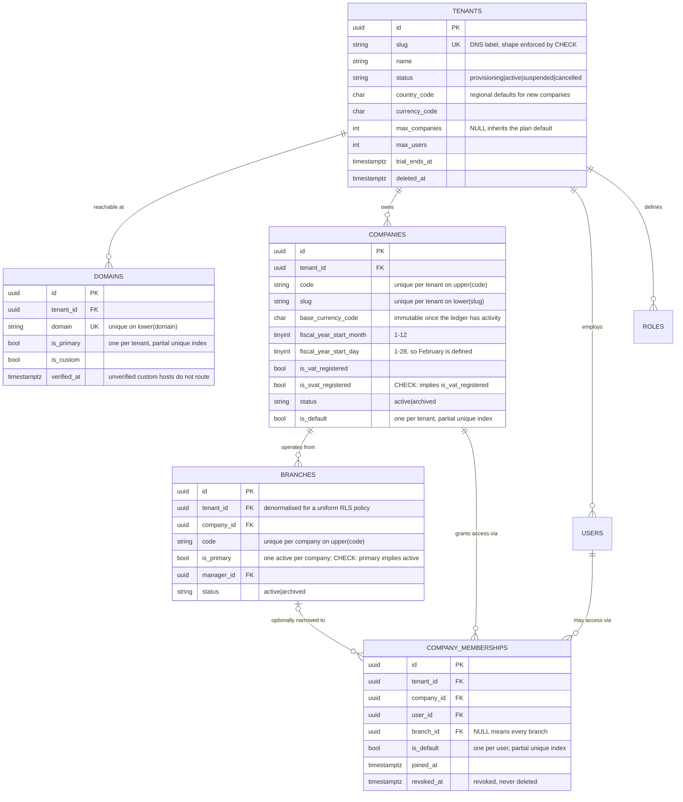
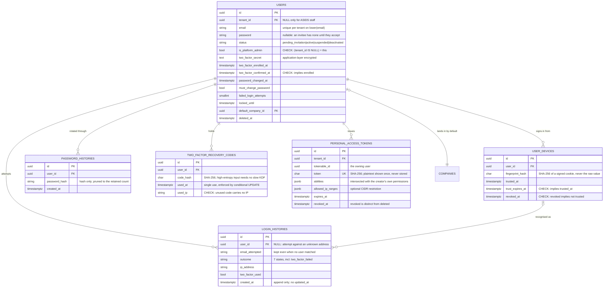
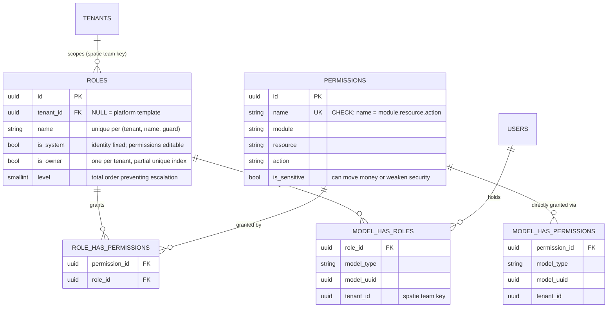
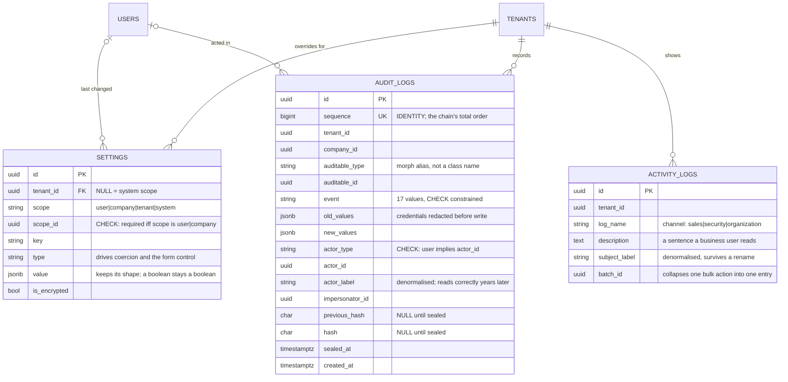
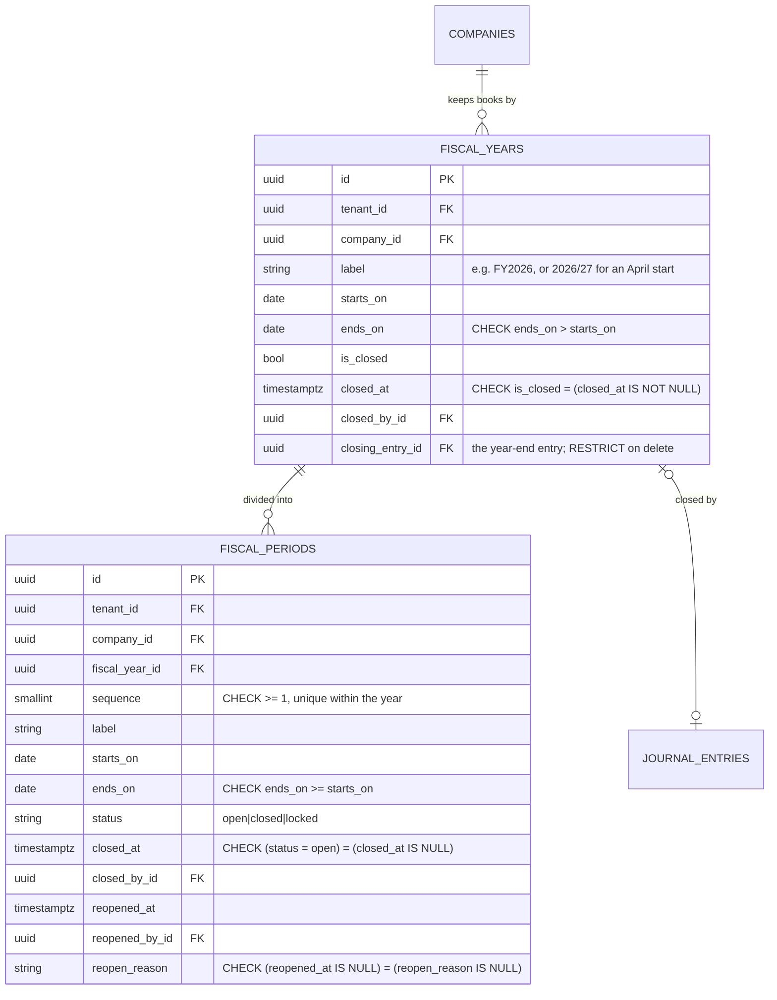
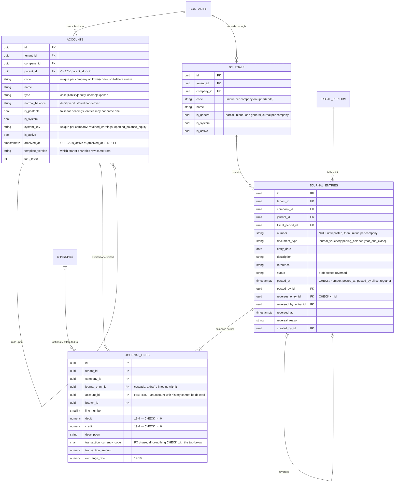
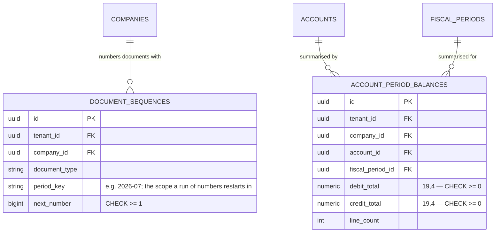

# Entity relationship diagram

Every table created by Phase 1 (the platform) and Phase 2 (the accounting core). Framework
infrastructure (`cache`, `jobs`, `job_batches`, `failed_jobs`, `sessions`, `notifications`,
`migrations`) is omitted — it carries no domain meaning.

## Reading this

- **`tenants` is the root.** It is the only table that is not tenant-scoped, because it *is*
  the tenant. Everything else carries `tenant_id`, and 16 tables have a FORCED PostgreSQL
  row level security policy keyed on it ([ADR 0001](../adr/0001-tenancy-strategy.md)).
- **`tenant_id` is denormalised onto child tables.** `branches` carries both `tenant_id` and
  `company_id` even though the first is derivable from the second. That costs 16 bytes a row
  and buys a uniform index prefix and a uniform RLS policy on every table in the platform.
- **A nullable `tenant_id` is meaningful, not sloppy.** On `users` it means ASIDS platform
  staff; on `roles` a platform template; on `settings` a system-scope default; on
  `audit_logs` an entry for a platform action. A check constraint enforces the `users` case:
  `(tenant_id IS NULL) = is_platform_admin`.

---

## Tenancy and organisation



**Why membership is a table and not a role.** A tenant administrator must be able to hire a
bookkeeper for one of five group companies without exposing the other four. A role answers
*what may this person do*; membership answers *whose books may they touch*. Both must pass.
Collapsing them would force a role per company per job function
([ADR 0002](../adr/0002-tenant-company-branch-hierarchy.md)).

---

## Identity and credentials



**No `password_reset_tokens`.** Laravel's table is keyed on the e-mail address, and an
address is unique only *within* a tenant — the same external accountant may hold accounts at
several customers, so a shared table would let a reset requested for workspace A be redeemed
in workspace B. `AccountLinkService` issues expiring signed links bound to the user's UUID
and current credential hash instead, which also makes them single-use with no token store.

---

## Authorization



**Permissions are global; roles are tenant data.** A permission is a capability the *software*
offers, so 100,000 copies of an identical catalogue would be waste. A role is a bundle a
*customer* defines — an "Accountant" at one firm is unrelated to another's. Wildcards are
disabled, so "who can void a posted invoice?" is a query rather than an inspection
([ADR 0003](../adr/0003-permissions-in-code-roles-in-data.md)).

The **owner** role holds no pivot rows: its authority comes from a `Gate::before` short
circuit on `is_owner`, so a capability added in a later phase is never accidentally withheld
from the person paying for the product.

---

## Settings and audit



**Two log tables, on purpose.** `audit_logs` is a compliance record: append-only, hash-chained,
seven-year retention, read by auditors. `activity_logs` is a product feature: a readable
sentence, mutable, ninety-day retention, read on dashboards. One table cannot be
simultaneously immutable and editable, verbose and readable.

`audit_logs` is guarded by a database trigger that refuses every `UPDATE` and `DELETE`, with
exactly two announced exceptions:

| Session variable | Permits | Constrained to |
| --- | --- | --- |
| `asids.audit_seal = 'on'` | `UPDATE` | Filling `previous_hash`, `hash`, `sealed_at` on a row where `sealed_at IS NULL`, with every other column byte-identical |
| `asids.audit_prune = 'on'` | `DELETE` | `asids:audit-prune` only |

A separate statement trigger blocks `TRUNCATE`, which bypasses row triggers entirely.

The chain is computed **out of band** by `asids:audit-seal` rather than at insert time.
Chaining inline requires reading the tenant's latest hash under a lock held for the whole
surrounding business transaction, which serialises every audited write in the workspace — at
10 million transactions that is the platform's ceiling. Rows are still written atomically
with the change they describe, so nothing is lost; only the newest few minutes are unsealed.

---

## The fiscal calendar

Dates alone cannot answer "may this be posted?", so periods are rows. A journal entry names the
period it falls in, and closing that period is what stops the figures moving underneath a filed
return.



Both tables carry a **GiST exclusion constraint** (`fiscal_years_no_overlap`,
`fiscal_periods_no_overlap`) on `(company_id, daterange(starts_on, ends_on))`. Two periods
covering the same day would make "which period does this entry belong to?" ambiguous, and the
answer would depend on row order. A unique index cannot express that; an exclusion constraint
can.

`reopen_reason` is not optional metadata. Reopening a closed period changes figures that may
already have been filed with the Inland Revenue Department, so the database refuses a reopening
that does not say why.

---

## The ledger



Four database-level rules carry the ledger's integrity, and they are in the database rather than
a service because a service can be bypassed by a migration, a console command or a future
developer in a hurry:

| Rule | Mechanism | What it prevents |
| --- | --- | --- |
| A line is debit **or** credit, never both, never neither | `journal_lines_one_sided_check` | A line that means two things at once |
| An entry's debits equal its credits | `journal_lines_balanced` — a **DEFERRABLE INITIALLY DEFERRED** constraint trigger | Books that do not balance. Deferred so a multi-line entry can be written a line at a time and is only checked at commit |
| A posted entry never changes | `journal_entries_immutable`, `journal_lines_immutable` row triggers | Editing history. Corrections go through a reversal, which is what an auditor expects to see |
| One currency until the FX phase | `journal_lines_single_currency_until_fx_phase` | Half-implemented multi-currency. The columns exist; the phase-scoped CHECK is dropped when FX ships, and the permanent all-or-nothing CHECK stays |

The balance trigger is `FOR EACH ROW` rather than `FOR EACH STATEMENT` because PostgreSQL does
not permit a statement-level constraint trigger. It therefore re-checks the same entry once per
line, which is redundant but correct.

> Deferred constraints do not fire under `RefreshDatabase`, because the wrapping transaction is
> rolled back rather than committed. Tests that mean to exercise the trigger must issue
> `SET CONSTRAINTS ALL IMMEDIATE` first, or they pass without the trigger ever running.

---

## Numbering and balances

Two supporting tables, both derived — and both of which state what they are derived from, so
neither becomes a second version of the truth.



**Numbering is gapless**, which a PostgreSQL sequence cannot provide: a sequence hands out a
number that is lost if the transaction rolls back, and a gap in a numbered document series is
exactly what a revenue authority asks about. Instead `document_sequences` holds a counter row
that is locked (`SELECT … FOR UPDATE`) inside the posting transaction, so a rollback returns the
number. The cost is that concurrent posts of the same document type serialise on that row, which
is the right trade for an SME's volume.

**`account_period_balances` is a cache, not a source.** `journal_lines` remains the truth. The
aggregate is updated inside the same transaction that posts an entry, and two commands exist
because a cache nobody can check is a liability:

```bash
php artisan asids:ledger-verify
```

```bash
php artisan asids:ledger-rebuild --tenant=<slug> --confirm
```

`asids:ledger-verify` recomputes from `journal_lines` and reports any account and period where
the aggregate disagrees; `asids:ledger-rebuild` rewrites the aggregates from the lines, and
requires both flags so it cannot be run absent-mindedly against the wrong tenant.

---

## Row level security coverage

| Policy | Tables | `USING` / `WITH CHECK` |
| --- | --- | --- |
| **Strict** (`tenant_id` NOT NULL) | `companies`, `branches`, `company_memberships`, `fiscal_years`, `fiscal_periods`, `accounts`, `journals`, `journal_entries`, `journal_lines`, `account_period_balances`, `document_sequences` | `bypass OR tenant_id = current` |
| **Nullable tenant** | `users`, `roles`, `model_has_roles`, `model_has_permissions`, `settings`, `audit_logs`, `activity_logs`, `notifications`, `personal_access_tokens`, `user_devices`, `login_histories`, `password_histories`, `two_factor_recovery_codes` | `bypass OR tenant_id IS NULL OR tenant_id = current` |
| **Excluded** | `tenants`, `domains`, `sessions`, `permissions`, `role_has_permissions` | Routing metadata, global catalogue, or read before tenant context exists |

Policies are `FORCE`d so they apply even when the connecting role owns the tables — otherwise
a developer connecting as the schema owner runs with protection silently disabled, and the
isolation tests pass without testing anything. `asids:security-check` fails a release if the
policies are not actually in force.

---

## Index strategy

Every tenant-scoped index leads with `tenant_id`, giving the planner a highly selective first
column: a tenant with 10,000 invoices reads its own 10,000 rows regardless of the other
999,990,000.

| Kind | Purpose | Examples |
| --- | --- | --- |
| Expression unique | Case-insensitive uniqueness | `users (tenant_id, lower(email))`, `companies (tenant_id, upper(code))`, `accounts (company_id, lower(code))`, `journals (company_id, upper(code))` |
| Partial unique | One-row-per-parent invariants | `companies (tenant_id) WHERE is_default`, `branches (company_id) WHERE is_primary`, `roles (tenant_id) WHERE is_owner`, `journals (company_id) WHERE is_general`, `journal_entries (company_id, number) WHERE number IS NOT NULL` |
| GiST exclusion | Non-overlapping date ranges | `fiscal_years`, `fiscal_periods` on `(company_id, daterange)` |
| Trigram GIN | Type-ahead pickers without a scan | `users` name and e-mail |
| `jsonb_path_ops` GIN | "Which change touched this field?" | `audit_logs.new_values`, `audit_logs.tags` |
| Partial b-tree | The sealer's work queue | `audit_logs (tenant_id, sequence) WHERE sealed_at IS NULL` |
| Composite b-tree | The ledger reads that matter, each named for its query | `journal_lines_account_lookup (company_id, account_id, journal_entry_id)`, `fiscal_periods_posting_lookup (company_id, starts_on, ends_on, status)`, `account_period_balances_trial_balance (company_id, fiscal_period_id)` |

Partial unique indexes are how single-row invariants are enforced *in the database* rather
than by a service that a bulk import could bypass. They are also why several service methods
demote the incumbent inside the same transaction — writing the new default first would be
rejected, leaving the first write committed.

## When to revisit

- A tenant-scoped table passing ~500M rows — consider hash partitioning on `tenant_id`.
- Any single tenant exceeding ~10% of total row volume — consider a dedicated database.
- `audit_logs` growth outpacing the seal interval — raise `--batch` or shorten the schedule.
